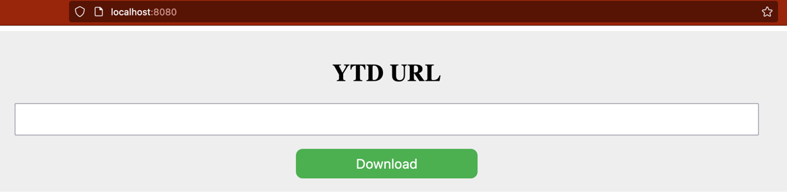

flask app to download videos. run below commands and access the webapp 

1. git clone https://github.com/santhoshkmr88/ytd-webapp.git && cd ytd-webapp
2. pip install requirements.txt
3. flask run
4. browser url "localhost:8080/"

Alternative:

1. git clone https://github.com/santhoshkmr88/ytd-webapp.git && cd ytd-webapp
2. docker build -t ytd-web .
3. docker run -p 8080:8080 ytd-web
4. browser url "localhost:8080/"

